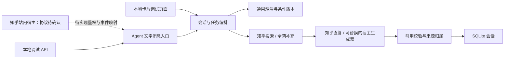

# 工程架构

## 分层

`agent/` 和 `src/lib/agent/definition.ts` 定义产品行为；`bridge.ts` 只接受内部消息结构，与浏览器和 Next.js 无关。当前运行时仍使用 Node.js/SQLite，并非可直接放进任意宿主沙箱的浏览器脚本。

## 对话与任务

通用条件为 `topic`、`purpose`、`scenario`、`constraints`、`priorities`。目的选项是了解、选择、解决问题和整体了解；领域不做枚举。规则只提取词面明确的信息，未识别的原话保存在 `free_text_context`，不宣称通用语义理解。

清晰问题直接回答。宽泛问题最多两轮追问，用户可自然补充或直接跳过。文字入口自动继续检索，卡片调试页在聚焦问题后支持确认。两者共用会话编排、停止规则和版本检查。

`ready → searching → generating → completed/error`。卡片回答接口通过 Next.js `after()` 在 202 后继续工作，前端 GET 轮询；文字调试接口等待完整结果并返回。进程重启将未完成任务标为 `INTERRUPTED`，不自动重放付费调用。

每次澄清或修改递增条件版本。答案保存条件快照；旧任务晚返回不能覆盖新版本。生成使用 request_id、事务和每会话唯一 running 请求。网络结果不明时先 GET 当前状态；初次创建消息暂不保证整轮投递幂等，正式宿主适配需增加宿主事件 ID 的去重。

## 知乎 Skill 适配

通过 Skill 的开发 HTTP 文档调用官方开放平台；无需在服务端启动 CLI。默认 1–2 次知乎检索，需要核查外部事实时额外 1 次全网检索。空结果最多简化一次，总搜索调用不超过 3 次。不同来源渠道有独立标记，内容 ID 按渠道隔离后去重。

回答生成只接收问题、已确认条件和引用资料。未知引用或非法 JSON 丢弃模型正文，降级展示真实摘要。编号有效不等于语义被证据支持，仍须人工评估。摘要按纯文本呈现，原始 URL 保留跟踪参数，只接受 HTTP(S)。

无结果不调用直答、不编造事实。限流/鉴权失败停止；普通部分失败注明范围；生成 POST 不自动重试。外部文档和用户原话只作为数据，不能覆盖 Agent 的行为约束。

## 身份与存储

调试层使用 HttpOnly/SameSite Cookie，数据库保存 token 摘要；会话 ID 不能单独取得数据。站内宿主身份必须经过官方协议验证，不能复用调试 Cookie 或直接信任客户端 user_id。

localStorage 只记录调试会话 ID。服务端会话保留 24 小时并定时级联清理。每个身份默认最多 50 个有效会话，每会话最多 20 个生成尝试。v0.2 使用独立默认数据库并拒绝旧版会话结构。

运行时适用于单进程持久磁盘。多实例部署需要共享数据库、持久队列和入口预算。尚未实现站内注册/回调/发布、模型意图提取、逐字流式回复和宿主事件幂等。
