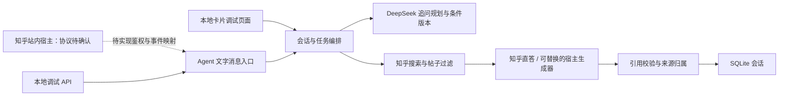

# 工程架构

## 分层

`agent/` 和 `src/lib/agent/definition.ts` 定义产品行为；`bridge.ts` 只接受内部消息结构，与浏览器和 Next.js 无关。当前运行时仍使用 Node.js/SQLite，并非可直接放进任意宿主沙箱的浏览器脚本。

## 对话与任务

通用条件为 `topic`、`purpose`、`scenario`、`constraints`、`priorities`；领域不做枚举。DeepSeek 根据原问题、显式条件、补充原文和 `clarification_history` 规划具体追问或直接回答。只生成问题与选项，不自动把模型猜测写成已确认事实；用户回答连同对应问题进入 `free_text_context`。本地关键词规则仅用于显式上下文提取及无密钥时的演示。

清晰问题直接回答。最多 5 轮追问，用户可自然补充或直接跳过；每轮判断是否已足够，不凑满轮数。动态卡片与文字入口完成补充后自动继续检索，共用会话编排、停止规则和版本检查。创建与追问为异步操作；模型请求在 SQLite 事务外执行，追问提交落库前再次核对版本，拒绝覆盖期间发生的编辑。模型失败保留原状态，提示重试或跳过，不自动退回固定卡片。模型输出经严格 JSON 校验，30 秒超时，不自动重试。

`ready → searching → generating → completed/error`。卡片回答接口通过 Next.js `after()` 在 202 后继续工作，前端 GET 轮询；文字调试接口等待完整结果并返回。进程重启将未完成任务标为 `INTERRUPTED`，不自动重放付费调用。

每次澄清或修改递增条件版本。答案保存条件快照；旧任务晚返回不能覆盖新版本。生成使用 request_id、事务和每会话唯一 running 请求。网络结果不明时先 GET 当前状态；初次创建消息暂不保证整轮投递幂等，正式宿主适配需增加宿主事件 ID 的去重。

## 知乎 Skill 适配

通过 Skill 的开发 HTTP 文档调用官方开放平台；无需在服务端启动 CLI。只调用 zhihu_search，不调用 global_search。默认真实模式且有 DeepSeek 密钥时，由 `search-intelligence.ts` 根据全部对话生成 1–2 条互补查询，每条获取最多 10 个候选（官方上限）。`retrieval.ts` 过滤站外 URL/非帖子类型、去重，再按摘要评估主题相关性及硬条件是否符合、未知或冲突。直接相关结果少于 3 篇时最多补搜一次，总搜索不超过 3 次。直接相关结果已足够时不以弱相关背景资料补足 5 篇。最终最多展示 5 篇，重新分配连续 ID 后才交给生成器。

评估必须覆盖全部候选 ID，重复、遗漏或未知 ID 的批次不可用；支持评估的引文必须在原始标题或摘要中连续出现。单条引文失败只跳过该条并注明，不让有效评估整体退回原始结果。完整批次失败或模型不可用时明确降级，不自动重试；补搜评估失败不恢复先前被判无关的结果。部分检索失败保留成功结果，全部失败或鉴权/限流错误照常终止。每个异步阶段检查会话版本，阻止过期任务继续发起后续调用。

`source-ranking.ts` 在相同 relevance 和 constraint_fit 层级内作确定性排序：评论 40%、赞同 35%、新近程度 25%。互动项使用 `min(1, log1p(count)/log1p(scale))`，评论 scale=1000、赞同 scale=10000；新近程度为 `1/(1+距更新时间天数/365)`。这些是可调整的产品偏好，不是准确率或可信度评分。缺失/非法计数和未知/未来日期不加分；完全相同的分数保留原候选次序。计数在 provider 中保留和校验，不交给语义评估模型，防止热度代替需求判断；未完成语义评估时不按热度重排。不增加搜索或模型调用。

相关性解释保存为 Source.relevance，候选数/筛选状态保存为 Answer.search_info。原始摘要、标题、作者和链接不改写，页面展示相关引文附近的原始摘要片段。相关性评估只是推断，不代表事实核验；缺少价格等信息不能被推断为满足条件。`deepseek.ts` 为追问与搜索共用传输，密钥只在服务端读取，原始上游错误不输出日志。搜索模型单次超时 20 秒，回答与文字入口预算调整为 300 秒。

卡片与文字结果优先呈现知乎帖子，保留标题、作者、摘要和原帖链接；卡片中的 AI 辅助总结默认折叠。回答生成只接收问题、已确认条件和知乎帖子摘要。合法结构化回答保留经过编号校验的引用；不合法的结构化回答降级为真实摘要。知乎直答也可能返回普通文本，此时保留原始内容但不给它分配检索引用，标记 evidence=unverified。编号有效不等于语义被证据支持，仍须人工评估。摘要按纯文本呈现，原始 URL 保留跟踪参数，只接受 HTTP(S) 的知乎帖子链接；当前不抓取全文。

ZHIHU_GENERATION_MODE=sources 跳过生成，只展示实际检索摘要；auto 模式调用直答。生成额度受限时也保留本次真实来源，不自动重试。无结果不调用直答、不编造事实。限流/鉴权失败停止；普通部分失败注明范围；生成 POST 不自动重试。外部文档和用户原话只作为数据，不能覆盖 Agent 的行为约束。

## 身份与存储

调试层使用 HttpOnly/SameSite Cookie，数据库保存 token 摘要；会话 ID 不能单独取得数据。站内宿主身份必须经过官方协议验证，不能复用调试 Cookie 或直接信任客户端 user_id。

localStorage 只记录调试会话 ID。服务端会话保留 24 小时并定时级联清理。每个身份默认最多 50 个有效会话，每会话最多 20 个生成尝试。v0.2 使用独立默认数据库并拒绝旧版会话结构。

运行时适用于单进程持久磁盘。多实例部署需要共享数据库、持久队列和入口预算。尚未实现站内注册/回调/发布、逐字流式回复和宿主事件幂等。
