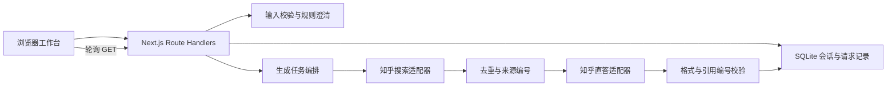

# 工程架构

## 边界

采用 Next.js App Router、React、TypeScript、Zod 和 Node.js 内置 SQLite。页面只调用本站 `/api`，访问知乎的凭证和请求始终留在服务端。业务原文不进入诊断日志。

## 会话与状态

初始理解在创建请求中同步完成。宽泛大学问题进入 `clarifying`，明确问题进入 `ready` 并返回 `auto_answer=true`。浏览器仅在刚刚发生的用户动作得到该标识时发起回答；恢复会话只 GET，不自动生成。

确认/直接回答 → `searching` → `generating` → `completed` 或 `error`。使用 Next.js `after()` 在 HTTP 202 后继续工作，适用于长驻单进程部署。没有持久任务队列，因此重启后将未完成任务标记 `INTERRUPTED`，保留原状态信息供用户手动重试。

每次提交澄清或修改条件递增 `context_version`。答案持有独立条件快照。旧任务提交结果前再次比对版本；新版本会将旧运行记录标为 superseded，旧结果不能写回。生成按钮、服务端事务、request_id 和每个会话最多一条 running 记录共同防止重复调用。

## 身份与保存

- 随机匿名凭证放在 HttpOnly/SameSite Cookie；数据库仅保存其 SHA-256 摘要。
- 读取会话时同时校验凭证与会话 ID。
- 浏览器 localStorage 只保存当前会话 ID，原文和来源保存在服务端。
- 每个会话自创建起保留 24 小时；到期在请求访问/每分钟清理任务中删除，并级联删除请求和反馈记录。
- 默认每个浏览器最多 50 个有效会话，每个会话最多 20 个回答请求。公网部署仍需要网关全局限流/总预算约束。

## 可信度与降级

真实模式优先应用检索，再让直答模型围绕所提供的摘要生成结构化内容。JSON 格式及引用编号均校验；未知引用或无效 JSON 导致整份模型正文被舍弃，改为展示已获得的摘要。编号正确只能证明链接存在，不能自动证明语义上支持结论，仍须人工抽查。

检索摘要先转为纯文本，再作为不可信参考材料。前端使用 React 文本节点，不接收原始 HTML，不开放 `dangerouslySetInnerHTML`。URL 仅接受 HTTP(S)，来源跟踪参数原样保留。不能可靠确认的时间字段不展示。

全空结果不调用生成模型，展示资料不足及一般性分析框架。限流/鉴权失败停止调用。部分普通检索失败保留成功来源并标注范围。直答 POST 不自动重试。

## 后续接入点

1. M0：实际账号权限、返回结构、延迟、摘要质量、结构化输出与引用忠实度的验证。
2. 意图层：将 `extractContext`/`nextCard` 的模板方案扩展为经 Zod 校验的模型提取，保留后端停止规则。
3. 检索层：增加官方域名配置与招生事实的全网补充搜索，仍遵守单次总查询预算。
4. 条件层：完善否定句、多学校名称和自由输入冲突识别，不能把词面命中视为通用语义理解。
5. 运行层：共享数据库、持久队列、入口限流、预算与不含原文的运行事件。

以上接入点不意味着当前版本已提供对应能力。
